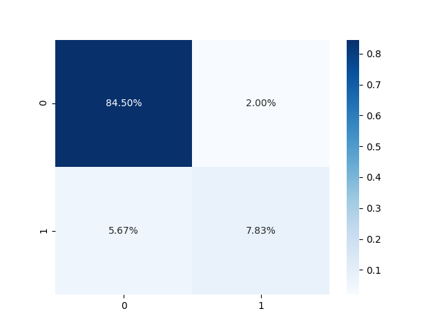
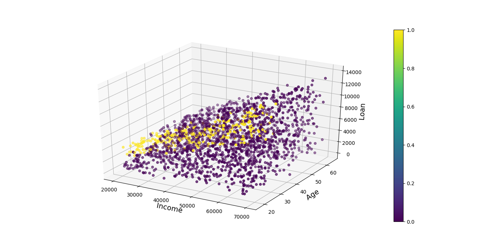

```text
.
├── api_test.py
├── app.py
├── data
│   └── credit_data.csv
├── docker-compose.yml
├── Dockerfile
├── figures
│   ├── Figure_1.png
│   ├── Figure_cv_2.png
│   └── Figure_split_3.png
├── README.md
├── requirements.txt
├── run.py
├── utils
│   ├── data.py
│   ├── __init__.py
│   ├── model.py
│   └── plot.py
└── weights
    ├── LogReg-e9xrh.pkl
    └── LogReg-mpi0q.pkl

4 directories, 17 files
```
```text
usage: run.py [-h] [--load LOAD] [--method {split,cv}]

optional arguments:
  -h, --help           show this help message and exit
  --load LOAD          True: Load trained model False: Train model default:
                       False
  --method {split,cv}  Training methods: cv- Cross-Validation default
                       10-Foldsplit- default 70 perc train, 30 perc test
```

# Train the model
### Train Test Split method
```shell
python run.py --load no --method split
```
#### Confusion Matrix


#### Accuracy Score:  0.926
```text
Do you want to save the model weight? yes
Model saved at weights/LogReg-z1f6y.pkl
```

### Cross-Validation method
```shell
python run.py --load no --method cv
```
#### Confusion Matrix


#### Accuracy Score:  0.948
```text
Do you want to save the model weight? yes
Model saved at weights/LogReg-n1u9q.pkl
```

# Load the trained model
```shell
python run.py --load yes
```
# Plot data
### Features: Income, Age, Loan 
### Labels: Default or not



```text
Note: Data is very inbalance
```

# Docker for the model

You can build Docker image by following:

```shell script
docker-compose build
```

## Run Docker container

You can launch a container from the Docker image by following:

```shell script
docker-compose up
```